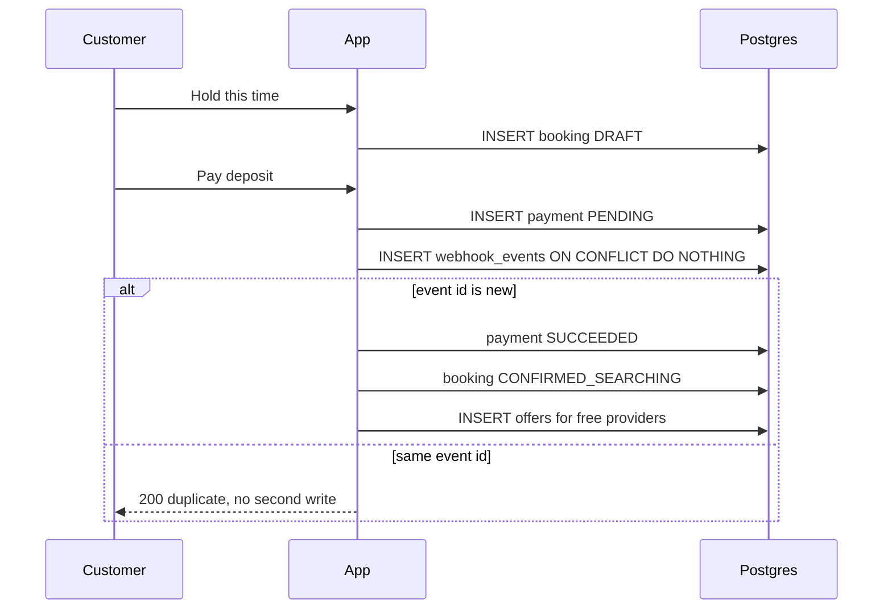
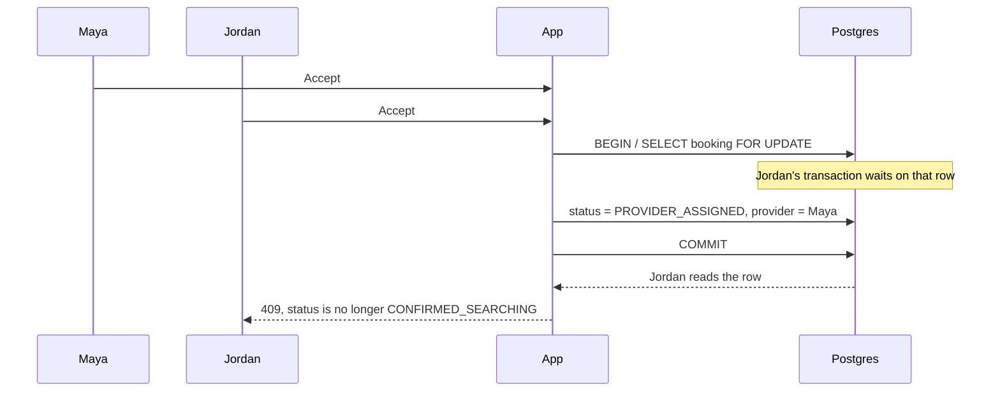

# Architecture

RKG Portal for Atlanta is one Next.js app and one Postgres database. Customers create a visit, a simulated Stripe webhook takes the deposit, and the first provider to accept owns the time range.

## States that exist

| Status | Meaning | How you get there |
| --- | --- | --- |
| `DRAFT` | Time and price are saved. Nobody has been offered the visit. | Customer holds a time. |
| `CONFIRMED_SEARCHING` | The 30% deposit succeeded. Eligible providers have an offer. | First `payment_intent.succeeded` for the deposit. |
| `PROVIDER_ASSIGNED` | One provider won. | `acceptBooking` committed. |
| `SERVICE_STARTED` | The remaining 70% succeeded. | First `payment_intent.succeeded` for the balance. |

A draft does not block the calendar. Two customers can request the same hour. The calendar closes when a provider is written onto a booking.

## Data

```text
services ──< bookings >── customers
                │
                ├── provider (nullable until accept)
                ├── payments
                └── dispatch_offers >── providers
providers ──< provider_availability

webhook_events   (primary key = Stripe event id)
```

`dispatch_offers` records who was asked and who lost. It is not the lock. The lock is the booking row, and the backstop is the exclusion constraint on the booking table.

## Deposit flow



The customer page sends the webhook itself so the demo uses the same handler a real Stripe delivery would use. Paying does not update the booking status in the deposit route. Only `processStripeEvent` does that.

## Accept lock

Two accepts of one visit:



The transaction always locks the booking row first, then the provider row. That order is the same for every accept, so the two waits cannot deadlock.

Inside the lock the handler also checks that this provider does not already have an assigned visit whose time range overlaps. That check is how the loser gets a clear error. It is not the guarantee.

The guarantee is:

```sql
EXCLUDE USING gist (
  provider_id WITH =,
  tstzrange(scheduled_start, scheduled_end, '[)') WITH &&
)
WHERE (
  provider_id IS NOT NULL
  AND status IN ('PROVIDER_ASSIGNED', 'SERVICE_STARTED')
)
```

`btree_gist` supplies the equality operator on `provider_id`. The range operator is overlap. Postgres will reject the second row even if the application check is skipped or two sessions race past it. The partial `WHERE` keeps drafts and open searches out of the calendar. A provider may be offered several visits. They may own only one at a time.

The dispatch button `POST /api/bookings/:id/race` calls `acceptBooking` twice with `Promise.all`. The UI shows the winner and the rejection.

## Webhook idempotency

`webhook_events.id` is the Stripe event id.

```text
BEGIN
  INSERT INTO webhook_events (id, ...) VALUES ($eventId, ...)
  ON CONFLICT (id) DO NOTHING
  RETURNING id
  -- no row: the event was already stored; return 200 and stop
  -- a row: lock the payment, then the booking
  -- mark the payment SUCCEEDED only if it is still PENDING
  -- move DRAFT -> CONFIRMED_SEARCHING only for a deposit
  -- move PROVIDER_ASSIGNED -> SERVICE_STARTED only for the balance
COMMIT
```

The insert and the status change commit together. If the process dies after the insert and before the commit, the event row rolls back and Stripe can retry. A retry with the same event id finds the row and returns 200 without a second charge.

A different event id for a payment that is already `SUCCEEDED` does not move the booking again. The payment update is conditional: `WHERE status = 'PENDING'`. The charge lives on the payment row. The event table stops replays of one delivery.

## What is intentionally absent

No login. The dispatch page is an open board so the walkthrough can act as either provider. Production would authenticate the provider id on accept.

No Redis. A lock that can expire, or stay held after a crash, is a second calendar. Postgres already releases row locks when the session ends.

No PostGIS. Eligibility for this slice is "active Atlanta provider whose weekly window covers the appointment." Drive time is a later filter, applied before the offer is created. It should not be inside the accept lock.

Notifications would be sent after the accept commits, not inside it.
